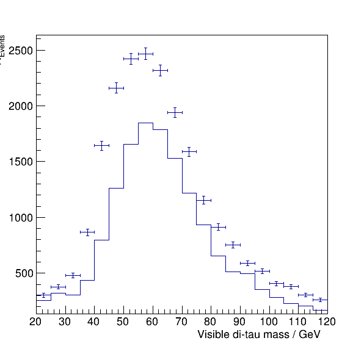

# RDF focus group

You'll find in the following instructions to do a typical NanoAOD based analysis!

Follow the steps below and apply them to each sample, eventually resulting in the following plot.

From a physics point of view the analysis has quite some flaws, but you see that data and simulation (very roughly) fits together.
Remember that the goal is not to have the a physically sane result but we look for the experience to get there technically ;)

Also note that you can find an example solution in the repository.

## Preparation

Download the files executing the `download.sh` script (you'll need `xrdcp`!). The samples will be placed in the `data/` folder with the following names:

Simulation samples:

- `DYJetsToLL.root`
- `W1JetsToLNu.root`
- `W2JetsToLNu.root`
- `W3JetsToLNu.root`
- `TTbar.root`

Data samples:

- `Run2012B_TauPlusX.root`
- `Run2012C_TauPlusX.root`

Each sample has a `TTree` called `Events` following the NanoAOD conventions.

## Selection

Following lists tell you for the `Muon_*` and `Tau_*` collections the baseline selection you have to apply so reduce the collections to the good candidates.

Minimal baseline selection:

- `HLT_IsoMu17_eta2p1_LooseIsoPFTau20 == true`
- `nMuon > 0`
- `nTau > 0`

For the `Muon_*` collections:

- `abs(Muon_eta) < 2.1`
- `Muon_pt > 17`
- `Muon_tightId == true`

For the `Tau_*` collections:

- `Tau_charge != 0`
- `abs(Tau_eta) < 2.3`
- `Tau_pt > 20`
- `Tau_idDecayMode == true`
- `Tau_idIsoTight == true`
- `Tau_idAntiEleTight == true`
- `Tau_idAntiMuTight == true`

## Pair building

Select the muon and the tau using following rules.

- Look only at muon-tau pairs with a `deltar>0.5` (see `ROOT::Math::VectorUtil::DeltaR`)
- Take the tau with the best (smallest) isolation (see the `Tau_relIso_all` collection)
- Take the muon with the highest pt (see the `Muon_pt` collection)
- For simplicity, we look first for the best isolated tau and then we search a suitable muon. Repeat with the next best tau if no muon fits the `deltar` requirement for the first tau.
- Skip the event if no pair can be found.

## Event weights

Each event from a simulated sample (not the data!) has to go with a weight, which scales the expectation accordingly. You can find the list of `cross_section`s and `num_events` in the file `metadata.csv`, and `lumi` is `1100` representing `1.1 fb^-1` of the given (reduced) dataset. In total, the event weight is given as `lumi * cross_section / num_events`.

## Compute the invariant mass

Take the identified pair of muon and tau and compute the invariant mass of the system by adding up the two fourvectors.

## Plot data versus simulation

Take all simulations of the background processes, stack them, and draw in a single plot the stacked simulations and the stacked data histograms. Use the computed invariant mass as the variable and plot from 20 to 120 (it's in GeV) using 5 GeV steps.
